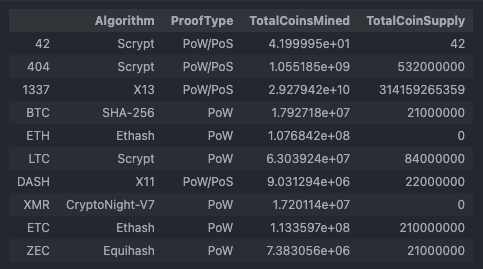
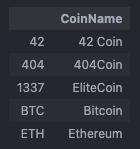

# Cryptocurrencies

Module 19: Unsupervised Machine Learning and Cryptocurrencies

## Background

You and Martha have done your research. You understand what unsupervised learning is used for, how to process data, how to cluster, how to reduce your dimensions, and how to reduce the principal components using PCA. It’s time to put all these skills to use by creating an analysis for your clients who are preparing to get into the cryptocurrency market.

Martha is a senior manager for the Advisory Services Team at Accountability Accounting, one of your most important clients. Accountability Accounting, a prominent investment bank, is interested in offering a new cryptocurrency investment portfolio for its customers. The company, however, is lost in the vast universe of cryptocurrencies. So, they’ve asked you to create a report that includes what cryptocurrencies are on the trading market and how they could be grouped to create a classification system for this new investment.

The data Martha will be working with is not ideal, so it will need to be processed to fit the machine learning models. Since there is no known output for what Martha is looking for, she has decided to use unsupervised learning. To group the cryptocurrencies, Martha decided on a clustering algorithm. She’ll use data visualizations to share her findings with the board.

### What You're Creating

This new assignment consists of four technical analysis parts:

- Part 1: Preprocessing the Data for PCA
- Part 2: Reducing Data Dimensions Using PCA
- Part 3: Clustering Cryptocurrencies Using K-means
- Part 4: Visualizing Cryptocurrencies Results

## Resources

- Data Source: [crypto_data.csv](link)
- Software:
- [Google Colaboratory](https://colab.research.google.com)
- [Visual Studio Code, 1.70.2](https://code.visualstudio.com/updates/v1_70)
- [Jupyter Notebook 6.4.8](https://jupyter-notebook.readthedocs.io/_/downloads/en/v6.4.8/pdf/)
- [Python 3.9.12](https://www.python.org/downloads/release/python-3912/)
  - [pandas](https://pandas.pydata.org)
  - [hvPlot](https://hvplot.holoviz.org)
  - [scikit-learn](https://scikit-learn.org/stable/)

## Requirements

Click this [link](https://github.com/abrodyyy/Cryptocurrencies/blob/a992061b03a288a387280cf996bcfd55d3d3dda0/crypto_clustering.ipynb#L1) for the full code for all 4 deliverables.

### Part 1: Preprocessing the Data for PCA

- The following five preprocessing steps have been performed on the crypto_df DataFrame:
  - All cryptocurrencies that are not being traded are removed
  - The IsTrading column is dropped
  - All the rows that have at least one null value are removed
  - All the rows that do not have coins being mined are removed
  -  The CoinName column is dropped

-  A new DataFrame is created that stores all cryptocurrency names from the CoinName column and retains the index from the crypto_df DataFrame
- The get_dummies() method is used to create variables for the text features, which are then stored in a new DataFrame, X
- The features from the X DataFrame have been standardized using the StandardScaler fit_transform() function

### Part 2: Reducing Data Dimensions Using PCA

- The PCA algorithm reduces the dimensions of the X DataFrame down to three principal components
- The pcs_df DataFrame is created and has the following three columns, PC 1, PC 2, and PC 3, and has the index from the crypto_df DataFrame

### Part 3: Clustering Cryptocurrencies Using K-means

- The K-means algorithm is used to cluster the cryptocurrencies using the PCA data, where the following steps have been completed:
  - An elbow curve is created using hvPlot to find the best value for K
  - Predictions are made on the K clusters of the cryptocurrencies’ data
    - A new DataFrame is created with the same index as the crypto_df DataFrame and has the following columns: Algorithm, ProofType, TotalCoinsMined, TotalCoinSupply, PC 1, PC 2, PC 3, CoinName, and Class

### Part 4: Visualizing Cryptocurrencies Results

- The clusters are plotted using a 3D scatter plot, and each data point shows the CoinName and Algorithm on hover
- A table with tradable cryptocurrencies is created using the hvplot.table() function
- The total number of tradable cryptocurrencies is printed
- A DataFrame is created that contains the clustered_df DataFrame index, the scaled data, and the CoinName and Class columns
- A hvplot scatter plot is created where the X-axis is "TotalCoinsMined", the Y-axis is "TotalCoinSupply", the data is ordered by "Class", and it shows the CoinName when you hover over the data point
